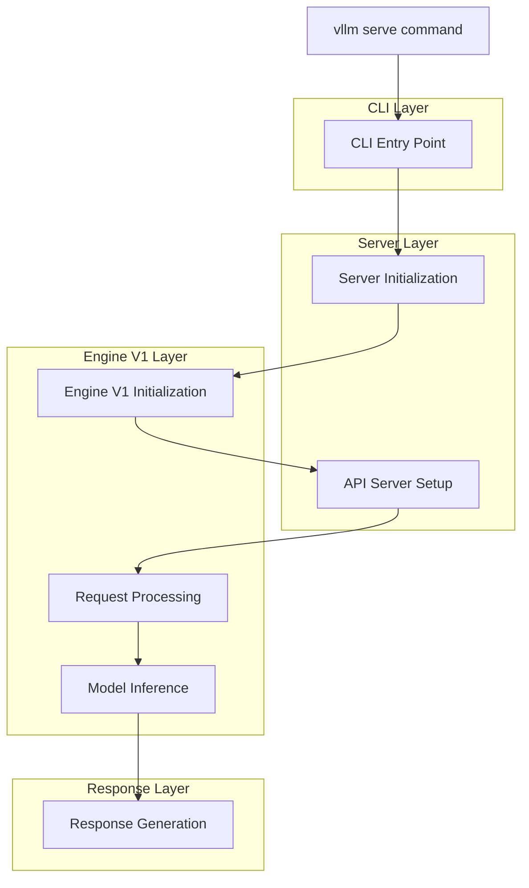
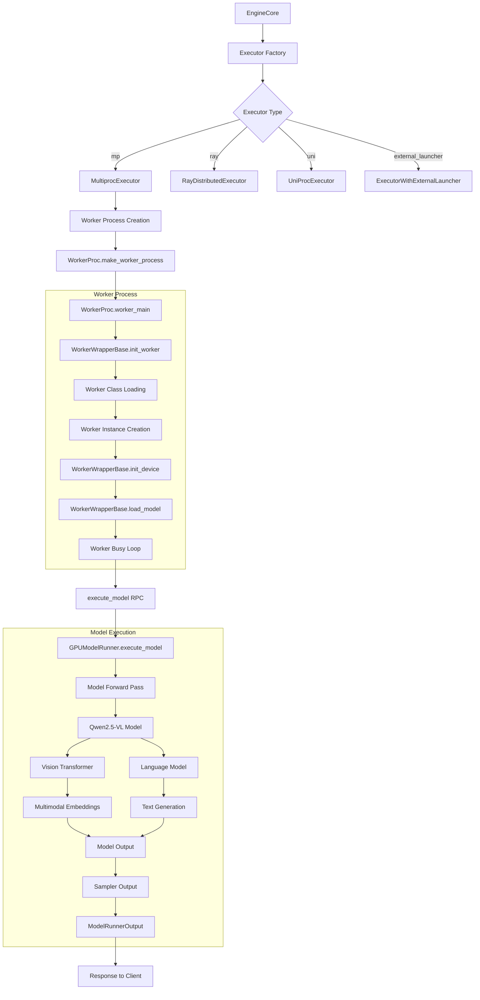

# vLLM Serve Pipeline - Engine V1 Function Call Flow

This document outlines the complete function call pipeline starting from `vllm serve` command in the vLLM repository, focusing on Engine V1 architecture.

## Overview

The vLLM serve pipeline follows a multi-layered architecture that processes requests from HTTP API endpoints through to model inference execution. The system is designed for high-throughput online inference serving with efficient memory management and batching.

## Pipeline Architecture



## Detailed Function Call Flow

### 1. CLI Entry Point

**File**: `vllm/entrypoints/cli/main.py`

```python
def main():
    # CLI setup and argument parsing
    cli_env_setup()
    parser = FlexibleArgumentParser(description="vLLM CLI")
    # ... subparser setup
    cmds[args.subparser].validate(args)
    args.dispatch_function(args)  # Calls serve command
```

**File**: `vllm/entrypoints/cli/serve.py`

```python
class ServeSubcommand(CLISubcommand):
    @staticmethod
    def cmd(args: argparse.Namespace) -> None:
        if args.headless or args.api_server_count < 1:
            run_headless(args)
        else:
            if args.api_server_count > 1:
                run_multi_api_server(args)
            else:
                # Single API server (this process)
                uvloop.run(run_server(args))
```

### 2. Server Initialization

**File**: `vllm/entrypoints/openai/api_server.py`

```python
async def run_server_worker(listen_address, sock, args, client_config=None, **uvicorn_kwargs):
    # Server worker initialization
    async with build_async_engine_client(args, usage_context=UsageContext.OPENAI_API_SERVER) as engine:
        # FastAPI app setup
        app = await init_app(args, llm_engine=engine)
        # HTTP server startup
        await serve_http(app, sock, ...)
```

### 3. Engine V1 Initialization

**File**: `vllm/entrypoints/openai/api_server.py`

```python
async def build_async_engine_client_from_engine_args(engine_args, ...):
    # Create the EngineConfig (determines if we can use V1)
    vllm_config = engine_args.create_engine_config(usage_context=usage_context)
    
    # V1 AsyncLLM initialization
    if envs.VLLM_USE_V1:
        from vllm.v1.engine.async_llm import AsyncLLM
        async_llm = AsyncLLM.from_vllm_config(
            vllm_config=vllm_config,
            usage_context=usage_context,
            enable_log_requests=engine_args.enable_log_requests,
            disable_log_stats=engine_args.disable_log_stats,
            client_addresses=client_config,
            client_count=client_count,
            client_index=client_index)
        yield async_llm
```

**File**: `vllm/v1/engine/async_llm.py`

```python
class AsyncLLM(EngineClient):
    def __init__(self, vllm_config, executor_class, log_stats, ...):
        # Initialize V1 AsyncLLM
        self.model_config = vllm_config.model_config
        self.vllm_config = vllm_config
        
        # Initialize EngineCore (separate process)
        self.engine_core = EngineCoreProc(vllm_config, executor_class, log_stats, ...)
        
        # Initialize output processor
        self.output_processor = OutputProcessor(...)
        
        # Initialize input processor
        self.processor = Processor(...)
```

**File**: `vllm/v1/engine/core.py`

```python
class EngineCore:
    def __init__(self, vllm_config, executor_class, log_stats, ...):
        # Initialize model executor
        self.model_executor = executor_class(vllm_config)
        
        # Initialize KV caches
        num_gpu_blocks, num_cpu_blocks, kv_cache_config = self._initialize_kv_caches(vllm_config)
        
        # Initialize scheduler
        self.scheduler = Scheduler(vllm_config=vllm_config, kv_cache_config=kv_cache_config, ...)
        
        # Initialize structured output manager
        self.structured_output_manager = StructuredOutputManager(...)
```

### 4. API Endpoints

**File**: `vllm/entrypoints/openai/api_server.py`

#### Chat Completions Endpoint
```python
@router.post("/v1/chat/completions")
@with_cancellation
@load_aware_call
async def create_chat_completion(request: ChatCompletionRequest, raw_request: Request):
    handler = chat(raw_request)
    generator = await handler.create_chat_completion(request, raw_request)
    # Handle streaming vs non-streaming responses
    if isinstance(generator, ErrorResponse):
        return JSONResponse(content=generator.model_dump(), status_code=generator.error.code)
    elif isinstance(generator, ChatCompletionResponse):
        return JSONResponse(content=generator.model_dump())
    return StreamingResponse(content=generator, media_type="text/event-stream")
```

#### Completions Endpoint
```python
@router.post("/v1/completions")
@with_cancellation
@load_aware_call
async def create_completion(request: CompletionRequest, raw_request: Request):
    handler = completion(raw_request)
    generator = await handler.create_completion(request, raw_request)
    # Handle streaming vs non-streaming responses
    if isinstance(generator, ErrorResponse):
        return JSONResponse(content=generator.model_dump(), status_code=generator.error.code)
    elif isinstance(generator, CompletionResponse):
        return JSONResponse(content=generator.model_dump())
    return StreamingResponse(content=generator, media_type="text/event-stream")
```

### 5. Request Processing Pipeline

**File**: `vllm/entrypoints/openai/serving_chat.py`

```python
class OpenAIServingChat(OpenAIServing):
    async def create_chat_completion(self, request: ChatCompletionRequest, raw_request: Request):
        # 1. Validate request and model
        error_check_ret = await self._check_model(request)
        if error_check_ret is not None:
            return error_check_ret
        
        # 2. Process chat messages and create sampling params
        sampling_params = self._create_sampling_params(request)
        
        # 3. Generate completion using engine
        generator = await self.engine_client.generate(
            prompt=prompt,
            sampling_params=sampling_params,
            request_id=request_id,
            lora_request=lora_request,
            trace_headers=trace_headers,
            priority=priority,
            data_parallel_rank=data_parallel_rank,
        )
        
        # 4. Process and return results
        return self._process_generation_results(generator, request, raw_request)
```

**File**: `vllm/v1/engine/async_llm.py`

```python
async def generate(self, prompt, sampling_params, request_id, ...):
    # 1. Start output handler if not already running
    self._run_output_handler()
    
    # 2. Add request to the engine
    q = await self.add_request(
        request_id, prompt, sampling_params,
        lora_request=lora_request,
        trace_headers=trace_headers,
        priority=priority,
        tokenization_kwargs=tokenization_kwargs,
        data_parallel_rank=data_parallel_rank,
    )
    
    # 3. Stream results back to caller
    finished = False
    while not finished:
        out = q.get_nowait() or await q.get()
        finished = out.finished
        yield out
```

### 6. Engine Core Processing

**File**: `vllm/v1/engine/core.py`

```python
def step(self) -> tuple[dict[int, EngineCoreOutputs], bool]:
    """Schedule, execute, and make output."""
    
    # 1. Check for requests in scheduler
    if not self.scheduler.has_requests():
        return {}, False
    
    # 2. Schedule requests
    scheduler_output = self.scheduler.schedule()
    
    # 3. Execute model
    model_output = self.execute_model_with_error_logging(
        self.model_executor.execute_model,
        scheduler_output)
    
    # 4. Update scheduler with outputs
    engine_core_outputs = self.scheduler.update_from_output(
        scheduler_output, model_output)
    
    return (engine_core_outputs, scheduler_output.total_num_scheduled_tokens > 0)
```

**File**: `vllm/v1/engine/core.py`

```python
def run_busy_loop(self):
    """Main execution loop in separate process."""
    while True:
        # 1. Process input queue (new requests)
        self._process_input_queue()
        
        # 2. Step the engine core and return outputs
        self._process_engine_step()
```

### 7. Model Execution

**File**: `vllm/v1/executor/abstract.py`

```python
class Executor(ABC):
    def execute_model(self, scheduler_output: SchedulerOutput) -> ModelRunnerOutput:
        """Execute the model with the given scheduler output."""
        # 1. Prepare input tensors
        # 2. Execute forward pass
        # 3. Process outputs
        # 4. Return model runner output
        pass
```

### 8. Executor Implementation Details

#### 8.1 Executor Class Hierarchy

**File**: `vllm/v1/executor/abstract.py`

```python
class Executor(ExecutorBase):
    """Abstract class for v1 executors, mainly define some methods for v1."""
    
    @staticmethod
    def get_class(vllm_config: VllmConfig) -> type["Executor"]:
        """Factory method to determine executor type based on configuration."""
        parallel_config = vllm_config.parallel_config
        distributed_executor_backend = parallel_config.distributed_executor_backend
        
        if distributed_executor_backend == "ray":
            from vllm.v1.executor.ray_distributed_executor import RayDistributedExecutor
            return RayDistributedExecutor
        elif distributed_executor_backend == "mp":
            from vllm.v1.executor.multiproc_executor import MultiprocExecutor
            return MultiprocExecutor
        elif distributed_executor_backend == "uni":
            return UniProcExecutor
        elif distributed_executor_backend == "external_launcher":
            return ExecutorWithExternalLauncher
```

#### 8.2 Multiprocessing Executor (MultiprocExecutor)

**File**: `vllm/v1/executor/multiproc_executor.py`

```python
class MultiprocExecutor(Executor):
    supports_pp: bool = True
    
    def _init_executor(self) -> None:
        """Initialize multiprocessing executor with worker processes."""
        # 1. Set up multiprocessing environment
        set_multiprocessing_worker_envs(self.parallel_config)
        
        # 2. Create distributed communication
        distributed_init_method = get_distributed_init_method(
            get_loopback_ip(), get_open_port())
        
        # 3. Initialize message queues for communication
        max_chunk_bytes = envs.VLLM_MQ_MAX_CHUNK_BYTES_MB * 1024 * 1024
        self.rpc_broadcast_mq = MessageQueue(self.world_size, self.world_size,
                                           max_chunk_bytes=max_chunk_bytes)
        
        # 4. Create worker processes
        context = get_mp_context()
        shared_worker_lock = context.Lock()
        unready_workers = []
        
        for rank in range(self.world_size):
            unready_workers.append(
                WorkerProc.make_worker_process(
                    vllm_config=self.vllm_config,
                    local_rank=rank,
                    rank=rank,
                    distributed_init_method=distributed_init_method,
                    input_shm_handle=scheduler_output_handle,
                    shared_worker_lock=shared_worker_lock,
                ))
        
        # 5. Wait for workers to be ready
        self.workers = WorkerProc.wait_for_ready(unready_workers)
        
        # 6. Start worker monitoring
        self.start_worker_monitor()
    
    def execute_model(self, scheduler_output: SchedulerOutput, non_block: bool = False):
        """Execute model using collective RPC to all workers."""
        if not self.has_connector:
            # Get output only from output_rank worker
            (output,) = self.collective_rpc(
                "execute_model",
                args=(scheduler_output,),
                unique_reply_rank=self.output_rank,
                non_block=non_block,
                timeout=envs.VLLM_EXECUTE_MODEL_TIMEOUT_SECONDS)
            return output
        else:
            # Get output from all workers and aggregate
            outputs = self.collective_rpc("execute_model", args=(scheduler_output,),
                                        non_block=non_block)
            return self.kv_output_aggregator.aggregate(outputs, self.output_rank)
```

#### 8.3 Worker Process Implementation

**File**: `vllm/v1/executor/multiproc_executor.py`

```python
class WorkerProc:
    """Wrapper that runs one Worker in a separate process."""
    
    @staticmethod
    def make_worker_process(vllm_config, local_rank, rank, 
                           distributed_init_method, input_shm_handle, 
                           shared_worker_lock) -> UnreadyWorkerProcHandle:
        """Create a new worker process."""
        context = get_mp_context()
        reader, writer = context.Pipe(duplex=False)
        death_reader, death_writer = context.Pipe(duplex=False)
        
        process_kwargs = {
            "vllm_config": vllm_config,
            "local_rank": local_rank,
            "rank": rank,
            "distributed_init_method": distributed_init_method,
            "input_shm_handle": input_shm_handle,
            "ready_pipe": (reader, writer),
            "death_pipe": death_reader,
            "shared_worker_lock": shared_worker_lock,
        }
        
        proc = context.Process(target=WorkerProc.worker_main,
                              kwargs=process_kwargs,
                              name=f"VllmWorker-{rank}",
                              daemon=True)
        proc.start()
        writer.close()
        return UnreadyWorkerProcHandle(proc, rank, reader, death_writer)
    
    @staticmethod
    def worker_main(*args, **kwargs):
        """Main worker process entry point."""
        # 1. Set up signal handlers for graceful shutdown
        def signal_handler(signum, frame):
            raise SystemExit()
        signal.signal(signal.SIGTERM, signal_handler)
        signal.signal(signal.SIGINT, signal_handler)
        
        # 2. Initialize worker
        worker = WorkerProc(*args, **kwargs)
        
        # 3. Send READY signal to parent
        ready_writer.send({
            "status": WorkerProc.READY_STR,
            "handle": worker.worker_response_mq.export_handle(),
        })
        
        # 4. Start worker busy loop
        worker.worker_busy_loop(cancel=shutdown_event)
    
    def worker_busy_loop(self, cancel: Optional[threading.Event] = None):
        """Main execution loop for worker processes."""
        while True:
            # 1. Dequeue RPC call from broadcast queue
            method, args, kwargs, output_rank = self.rpc_broadcast_mq.dequeue(cancel=cancel)
            
            try:
                # 2. Execute the method on worker
                if isinstance(method, str):
                    func = getattr(self.worker, method)
                elif isinstance(method, bytes):
                    func = partial(cloudpickle.loads(method), self.worker)
                
                # 3. Handle multimodal cache if needed
                if self.mm_receiver_cache is not None and func.__name__ == "execute_model":
                    get_and_update_mm_cache(self.mm_receiver_cache, args)
                
                # 4. Execute the function
                output = func(*args, **kwargs)
                
            except Exception as e:
                # 5. Handle errors and send failure response
                if output_rank is None or self.rank == output_rank:
                    self.handle_output(e)
                continue
            
            # 6. Send success response
            if output_rank is None or self.rank == output_rank:
                self.handle_output(output)
```

#### 8.4 Worker Initialization and Model Loading

**File**: `vllm/worker/worker_base.py`

```python
class WorkerWrapperBase:
    """Wrapper for worker lifecycle management."""
    
    def init_worker(self, all_kwargs: List[Dict[str, Any]]) -> None:
        """Initialize the worker with configuration."""
        kwargs = all_kwargs[self.rpc_rank]
        self.vllm_config = kwargs.get("vllm_config")
        
        # 1. Load worker class dynamically
        if isinstance(self.vllm_config.parallel_config.worker_cls, str):
            worker_class = resolve_obj_by_qualname(
                self.vllm_config.parallel_config.worker_cls)
        else:
            worker_class = cloudpickle.loads(
                self.vllm_config.parallel_config.worker_cls)
        
        # 2. Handle worker extensions
        if self.vllm_config.parallel_config.worker_extension_cls:
            worker_extension_cls = resolve_obj_by_qualname(
                self.vllm_config.parallel_config.worker_extension_cls)
            # Dynamically inherit the worker extension class
            worker_class.__bases__ = worker_class.__bases__ + (worker_extension_cls,)
        
        # 3. Create worker instance
        with set_current_vllm_config(self.vllm_config):
            self.worker = worker_class(**kwargs)
    
    def init_device(self):
        """Initialize device and load model."""
        with set_current_vllm_config(self.vllm_config):
            self.worker.init_device()  # Initialize CUDA/device state
    
    def load_model(self):
        """Load the model onto device."""
        with set_current_vllm_config(self.vllm_config):
            self.worker.load_model()  # Load model weights
```

#### 8.5 GPU Model Runner Execution

**File**: `vllm/v1/worker/gpu_model_runner.py`

```python
class GPUModelRunner:
    def execute_model(self, scheduler_output: "SchedulerOutput", 
                     intermediate_tensors: Optional[IntermediateTensors] = None):
        """Execute model forward pass on GPU."""
        
        with record_function_or_nullcontext("Preprocess"):
            # 1. Update internal states
            self._update_states(scheduler_output)
            
            # 2. Prepare inputs and attention metadata
            (attn_metadata, logits_indices, spec_decode_metadata,
             num_scheduled_tokens_np, spec_decode_common_attn_metadata,
             max_query_len) = self._prepare_inputs(scheduler_output)
            
            # 3. Preprocess model inputs
            (num_scheduled_tokens, num_input_tokens, num_tokens_across_dp,
             input_ids, inputs_embeds, positions, intermediate_tensors,
             model_kwargs) = self._preprocess(scheduler_output, intermediate_tensors)
        
        # 4. Run the model forward pass
        with record_function_or_nullcontext("Forward"):
            model_output = self.model(
                input_ids=input_ids,
                positions=positions,
                intermediate_tensors=intermediate_tensors,
                inputs_embeds=inputs_embeds,
                **model_kwargs,
            )
        
        with record_function_or_nullcontext("Postprocess"):
            # 5. Process model outputs
            if self.use_aux_hidden_state_outputs:
                hidden_states, aux_hidden_states = model_output
            else:
                hidden_states = model_output
                aux_hidden_states = None
            
            # 6. Compute logits
            sample_hidden_states = hidden_states[logits_indices]
            logits = self.model.compute_logits(sample_hidden_states, None)
        
        with record_function_or_nullcontext("Sample"):
            # 7. Sample tokens
            sampler_output = self._sample(logits, spec_decode_metadata)
        
        with record_function_or_nullcontext("Bookkeep"):
            # 8. Bookkeeping and cleanup
            (num_nans_in_logits, logprobs_lists, valid_sampled_token_ids,
             prompt_logprobs_dict, req_ids_output_copy,
             req_id_to_index_output_copy, invalid_req_indices) = \
                self._bookkeeping_sync(scheduler_output, sampler_output, logits,
                                     hidden_states, num_scheduled_tokens)
        
        # 9. Return model runner output
        return ModelRunnerOutput(
            req_ids=req_ids_output_copy,
            req_id_to_index=req_id_to_index_output_copy,
            sampled_token_ids=valid_sampled_token_ids,
            logprobs=logprobs_lists,
            prompt_logprobs_dict=prompt_logprobs_dict,
            pooler_output=[],
            kv_connector_output=kv_connector_output,
            num_nans_in_logits=num_nans_in_logits,
        )
```

#### 8.6 Qwen2.5-VL Model Implementation

**File**: `vllm/model_executor/models/qwen2_5_vl.py`

```python
class Qwen2_5_VLForConditionalGeneration(nn.Module, SupportsMultiModal, 
                                        SupportsLoRA, SupportsPP, SupportsQuant):
    """Qwen2.5-VL model implementation with multimodal support."""
    
    def __init__(self, *, vllm_config: VllmConfig, prefix: str = ""):
        super().__init__()
        config = vllm_config.model_config.hf_config
        multimodal_config = vllm_config.model_config.multimodal_config
        
        # 1. Initialize vision transformer for multimodal inputs
        if multimodal_config.get_limit_per_prompt("image") or \
           multimodal_config.get_limit_per_prompt("video"):
            self.visual = Qwen2_5_VisionTransformer(
                config.vision_config,
                norm_eps=getattr(config, "rms_norm_eps", 1e-6),
                quant_config=self._maybe_ignore_quant_config(self.quant_config),
                prefix=maybe_prefix(prefix, "visual"),
                use_data_parallel=self.use_data_parallel,
            )
        else:
            self.visual = None
        
        # 2. Initialize language model backbone
        self.language_model = init_vllm_registered_model(
            vllm_config=vllm_config,
            prefix=maybe_prefix(prefix, "language_model"),
            architectures=["Qwen2ForCausalLM"],
        )
    
    def get_multimodal_embeddings(self, **kwargs: object) -> MultiModalEmbeddings:
        """Process multimodal inputs (images/videos) and return embeddings."""
        mm_input_by_modality = self._parse_and_validate_multimodal_inputs(**kwargs)
        if not mm_input_by_modality:
            return []
        
        multimodal_embeddings = ()
        
        # Process each modality (image/video)
        for modality in mm_input_by_modality:
            multimodal_input = mm_input_by_modality[modality]
            if modality == "image":
                vision_embeddings = self._process_image_input(multimodal_input)
                multimodal_embeddings += vision_embeddings
            if modality == "video":
                video_embeddings = self._process_video_input(multimodal_input)
                multimodal_embeddings += video_embeddings
        
        return multimodal_embeddings
    
    def forward(self, input_ids: torch.Tensor, positions: torch.Tensor,
                intermediate_tensors: Optional[IntermediateTensors] = None,
                inputs_embeds: Optional[torch.Tensor] = None, **kwargs: object):
        """Forward pass for Qwen2.5-VL model."""
        
        # 1. Process multimodal inputs if needed
        if inputs_embeds is None and intermediate_tensors is None:
            image_input = self._parse_and_validate_image_input(**kwargs)
            video_input = self._parse_and_validate_video_input(**kwargs)
            
            if image_input is not None or video_input is not None:
                inputs_embeds = self.get_input_embeddings_v0(
                    input_ids, image_input=image_input, video_input=video_input)
                input_ids = None
        
        # 2. Run language model forward pass
        hidden_states = self.language_model.model(
            input_ids=input_ids,
            positions=positions,
            intermediate_tensors=intermediate_tensors,
            inputs_embeds=inputs_embeds,
        )
        
        return hidden_states
```

## Key Components

### Engine V1 Architecture

1. **AsyncLLM**: Main interface for V1 engine, handles request management and output processing
2. **EngineCore**: Core execution engine running in separate process, handles scheduling and model execution
3. **Scheduler**: Manages request scheduling, batching, and resource allocation
4. **ModelExecutor**: Handles actual model execution (can be multiprocess, GPU, etc.)
5. **OutputProcessor**: Processes model outputs and converts to request outputs
6. **InputProcessor**: Handles input preprocessing and tokenization

### Executor Dependencies and Worker Flow



### Detailed Function Call Dependencies

#### 1. Executor Initialization Flow
```
EngineCore.__init__()
├── Executor.get_class(vllm_config)
│   ├── Check distributed_executor_backend
│   ├── Return appropriate executor class
│   └── MultiprocExecutor/RayDistributedExecutor/UniProcExecutor
├── Executor._init_executor()
│   ├── Set up multiprocessing environment
│   ├── Create distributed communication
│   ├── Initialize message queues
│   ├── Create worker processes
│   └── Start worker monitoring
└── Executor ready for model execution
```

#### 2. Worker Process Lifecycle
```
WorkerProc.make_worker_process()
├── Create process with worker_main target
├── Set up communication pipes
├── Start worker process
└── Return UnreadyWorkerProcHandle

WorkerProc.worker_main()
├── Set up signal handlers
├── Initialize WorkerProc instance
│   ├── WorkerWrapperBase.__init__()
│   ├── WorkerWrapperBase.init_worker()
│   │   ├── Load worker class dynamically
│   │   ├── Handle worker extensions
│   │   └── Create worker instance
│   ├── WorkerWrapperBase.init_device()
│   └── WorkerWrapperBase.load_model()
├── Send READY signal to parent
└── Start worker_busy_loop()

WorkerProc.worker_busy_loop()
├── Dequeue RPC calls from broadcast queue
├── Execute methods on worker
├── Handle multimodal cache updates
├── Send responses back to executor
└── Continue loop until shutdown
```

#### 3. Model Execution Flow
```
Executor.execute_model(scheduler_output)
├── MultiprocExecutor.execute_model()
│   ├── collective_rpc("execute_model", args=(scheduler_output,))
│   └── Return aggregated output
│
Worker.execute_model(scheduler_output)
├── GPUWorker.execute_model()
│   ├── Handle pipeline parallel intermediate tensors
│   └── Call GPUModelRunner.execute_model()
│
GPUModelRunner.execute_model()
├── Preprocess phase
│   ├── Update internal states
│   ├── Prepare attention metadata
│   └── Preprocess model inputs
├── Forward phase
│   └── Model forward pass
├── Postprocess phase
│   ├── Process model outputs
│   └── Compute logits
├── Sample phase
│   └── Sample tokens
├── Bookkeep phase
│   └── Cleanup and bookkeeping
└── Return ModelRunnerOutput
```

#### 4. Qwen2.5-VL Model Execution
```
Qwen2_5_VLForConditionalGeneration.forward()
├── Parse and validate multimodal inputs
│   ├── _parse_and_validate_image_input()
│   └── _parse_and_validate_video_input()
├── Process multimodal embeddings
│   ├── get_multimodal_embeddings()
│   ├── _process_image_input() → Vision Transformer
│   └── _process_video_input() → Vision Transformer
├── Get input embeddings
│   ├── get_input_embeddings()
│   └── merge_multimodal_embeddings()
└── Language model forward pass
    └── language_model.model()
        ├── Process text tokens
        ├── Process multimodal embeddings
        └── Return hidden states
```

### Key Dependencies

#### Executor Dependencies
- **MultiprocExecutor**: Depends on multiprocessing, shared memory, message queues
- **RayDistributedExecutor**: Depends on Ray framework for distributed execution
- **UniProcExecutor**: Single-process execution, minimal dependencies
- **ExecutorWithExternalLauncher**: Depends on external launcher (e.g., torchrun)

#### Worker Dependencies
- **WorkerWrapperBase**: Manages worker lifecycle and configuration
- **Worker Classes**: Model-specific worker implementations (GPUWorker, CPUWorker, TPUWorker)
- **Model Runners**: GPUModelRunner, CPUModelRunner, TPUModelRunner
- **Model Implementations**: Qwen2.5-VL, other model architectures

#### Model Execution Dependencies
- **Attention Mechanisms**: Flash Attention, xFormers, PyTorch SDPA
- **Multimodal Processing**: Vision transformers, image/video encoders
- **Sampling**: Various sampling strategies and logits processors
- **Memory Management**: KV cache, memory pooling, tensor operations

### Request Flow

1. **HTTP Request** → FastAPI endpoint
2. **Request Validation** → Parameter validation and model checking
3. **Request Processing** → Convert to internal format, create sampling params
4. **Engine Submission** → Add request to AsyncLLM
5. **Scheduling** → Scheduler determines when to execute
6. **Model Execution** → Executor runs the model
7. **Output Processing** → Convert model outputs to request outputs
8. **Response Generation** → Format and return to client

### Key Features

- **Multiprocess Architecture**: Engine runs in separate process for isolation
- **Efficient Batching**: Multiple requests processed together for better GPU utilization
- **Streaming Support**: Real-time streaming of generated text
- **Memory Management**: Sophisticated KV cache and memory management
- **Parallel Execution**: Support for tensor parallelism, pipeline parallelism, and data parallelism
- **Request Scheduling**: Advanced scheduling policies for optimal throughput

## Environment Variables

- `VLLM_USE_V1`: Controls whether to use V1 engine (default: auto-detect)
- `VLLM_WORKER_MULTIPROC_METHOD`: Multiprocessing method for workers
- `VLLM_HTTP_TIMEOUT_KEEP_ALIVE`: HTTP keep-alive timeout

## Configuration

The pipeline is configured through:
- CLI arguments (model, port, etc.)
- Engine configuration (VllmConfig)
- Model configuration (ModelConfig)
- Scheduler configuration (SchedulerConfig)
- Cache configuration (CacheConfig)

## Summary

This comprehensive documentation outlines the complete vLLM Serve Pipeline for Engine V1, with detailed function call dependencies and worker initialization flows. The architecture provides:

### Key Architectural Benefits

1. **Modular Design**: Clear separation between executors, workers, and model runners
2. **Scalability**: Support for multiple execution backends (multiprocessing, Ray, single-process)
3. **Multimodal Support**: Native support for vision-language models like Qwen2.5-VL
4. **Efficient Memory Management**: Sophisticated KV cache and memory pooling
5. **High Performance**: Optimized attention mechanisms and tensor operations
6. **Fault Tolerance**: Worker monitoring and graceful error handling

### Executor Implementation Highlights

- **MultiprocExecutor**: Most commonly used, supports pipeline parallelism
- **RayDistributedExecutor**: For distributed computing environments
- **UniProcExecutor**: Single-process execution for simple deployments
- **ExecutorWithExternalLauncher**: For torchrun-compatible launchers

### Worker Process Management

- **Dynamic Loading**: Workers are loaded dynamically based on configuration
- **Lifecycle Management**: Comprehensive initialization, execution, and cleanup
- **Communication**: Efficient RPC-based communication between executor and workers
- **Error Handling**: Robust error handling and worker monitoring

### Model Execution Pipeline

- **Preprocessing**: Input preparation and attention metadata generation
- **Forward Pass**: Model execution with multimodal support
- **Postprocessing**: Output processing and logits computation
- **Sampling**: Token sampling and generation
- **Bookkeeping**: Cleanup and state management

This architecture provides a robust, scalable foundation for high-performance LLM serving with Engine V1, supporting both text-only and multimodal models with efficient resource utilization and fault tolerance.

